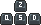
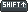
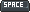
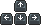

# Controls (Azerty layout)

## Gameplay

 Control the player

 Sneak / Move Down

 Jump / Move Up

 Sprint

 Open inventory

 Break block

 Place block

 Select block from environment

## Camera

 Toggle mouse focus

 Rotate the camera (mouse focused)

 Rotate the camera (mouse unfocused)

 or  Toggle perspective mode

## Miscellaneous

 Toggle HUD

 Take screenshot

## Debug

 Show debug info

 +  Toggle spectator mode

 +  Toggle creative mode

 +  Toggle wireframe mode

 +  Show chunk borders

 +  Show AABBs

 +  Reload chunk meshes